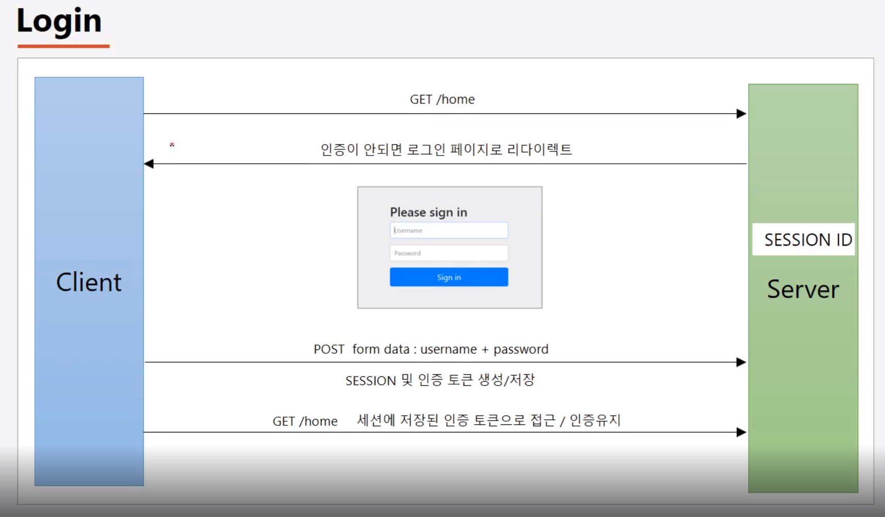

# SecurityTheory

## 목차
1. [보안 정책 설정](#1-보안-정책-설정)
2. [인증 API](#2-인증-api)

## 1. 보안 정책 설정
### 1. 자원 및 권한 설정
1. 마이페이지
    - 자원설정 : /mypage
    - 권한 매핑 : ROLE_USER   
2. 메시지
    - 자원설정 : /mypage
    - 권한 매핑 : ROLE_USER   
3. 환경설정
    - 자원설정 : /mypage
    - 권한 매핑 : ROLE_USER   
4. 관리자
    - 자원설정 : /mypage
    - 권한 매핑 : ROLE_USER

### 2. 사용자 등록 및 권한 부여

### 3. 권한 계층 적용
ROLE_ADMIN > ROLE_MANAGER > ROLE_USER

### 4. 메서드 보안 설정
1. 메서드 보안 : 서비스 계층 메소드 접근 제어
2. 포인트컷 보안 : 포인트컷 표현식에 따른 메소드 접근 제어

### 5. IP 제한

 

## 2. 인증 API
### 01 - 스프링 시큐리티 의존성 추가
- 서버가 기동되면 스프링 시큐리티의 초기화 작업 및 보안 설정이 이루어짐
- 별도의 설정이나 구현을 하지 않아도 기본적인 웹 보안 기능이 현재 시스템에 연동되어 작동
     - 모든 요청은 인증이 되어야 자원에 접근 가능 
     - 인증 방식은 폼 로그인 방식과 httpBasic 로그인 방식을 제공
     - 기본 로그인 페이지 제공
     - 기본 계정 한 개 제곻 (username : user, password : 랜덤 문자열)
- 문제점
     - 계정 추가, 권한 추가, DB연동 등
     - 기본적인 보안 기능 외에 시스템에서 필요로 하는 더 세부적이고 추가적인 보안 기능이 필요함

### 02 - 사용자 정의 보안 기능 구현

### 03 - Form 인증

